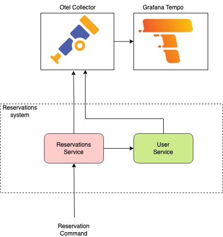
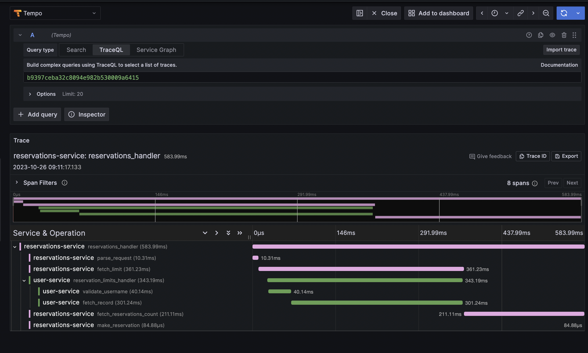

## Overview
Playground project that shows how to establish tracing with OpenTelemetry and Grafana Tempo in distributed system consiting of Python services. 

The system expose functionality of downloading items by users if the user has enough credits. The implementation is simplifed (functions are usually mocked) because the main focus is on tracing.

## Architecture


## How to run
### Prerequisites
- [Docker](https://docs.docker.com/engine/install/)
- [Docker Compose](https://docs.docker.com/compose/install/)

### Build the images
`>> docker build -t user-service:v1 ./user-service`

`>> docker build -t reservations-service:v1 ./reservations-service`

### Start the services
`>> docker-compose up`

### Make a request
`>> curl -X POST http://localhost:8081/reservations -H "Content-Type: application/json" -d '{"username": "test", "item_id": "123"}'`

## How to see the traces
### Grafana Tempo
Open the Tempo UI: http://localhost:3000/

### Example trace view



## Opentelemetry configuration
```python
from opentelemetry import trace
from opentelemetry.exporter.otlp.proto.grpc.trace_exporter import \
    OTLPSpanExporter
from opentelemetry.sdk.resources import Resource
from opentelemetry.sdk.trace import TracerProvider
from opentelemetry.sdk.trace.export import BatchSpanProcessor

SERVICE_NAME = "user-service"
OTEL_COLLECTOR_ENDPOINT = os.environ.get("OTEL_COLLECTOR_ENDPOINT", "localhost:4317")

resource = Resource(
    attributes={
        "service.name": SERVICE_NAME,
    }
)

provider = TracerProvider(resource=resource)
otlp_exporter = OTLPSpanExporter(endpoint=OTEL_COLLECTOR_ENDPOINT, insecure=True)
processor = BatchSpanProcessor(otlp_exporter)
provider.add_span_processor(processor)

trace.set_tracer_provider(provider)
tracer = trace.get_tracer(SERVICE_NAME)
```

## Adding spans
```python
from flask import Flask, request

tracer = trace.get_tracer(SERVICE_NAME)
app = Flask(__name__)

@app.route("/reservations", methods=["POST"])
def reservations():
    with tracer.start_as_current_span("reservations_handler"):
        command = _parse_request(request)
        ...


@tracer.start_as_current_span("parse_request")
def _parse_request(request):
    ...
```


## Context propagation
Context propagation is needed to pass the tracing context between services. The context is passed in the headers of the request (traceparent header, see the [docs](https://www.w3.org/TR/trace-context)). Thanks to it spans in different services can be connected into one trace.

### Injecting context to outgoing requests
```python
import requests
from opentelemetry.trace.propagation.tracecontext import TraceContextTextMapPropagator

with tracer.start_as_current_span("reservations_handler"):
    carrier = {}
    TraceContextTextMapPropagator().inject(carrier=carrier)
    response = requests.get("http://user-service:8080/users/x/limits", headers=carrier)
```

### Extracting context from incoming requests
```python
from opentelemetry.trace.propagation.tracecontext import TraceContextTextMapPropagator

carrier = request.headers
context = TraceContextTextMapPropagator().extract(carrier=carrier)
with tracer.start_as_current_span("limits_handler", context=context):
    ...
```
